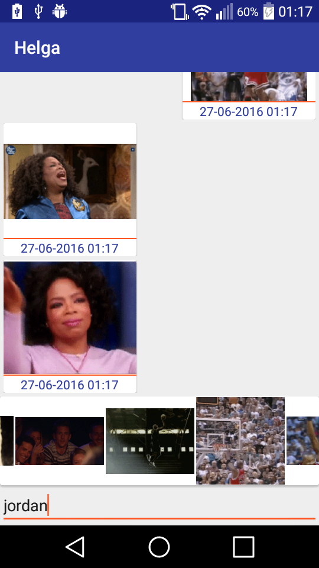
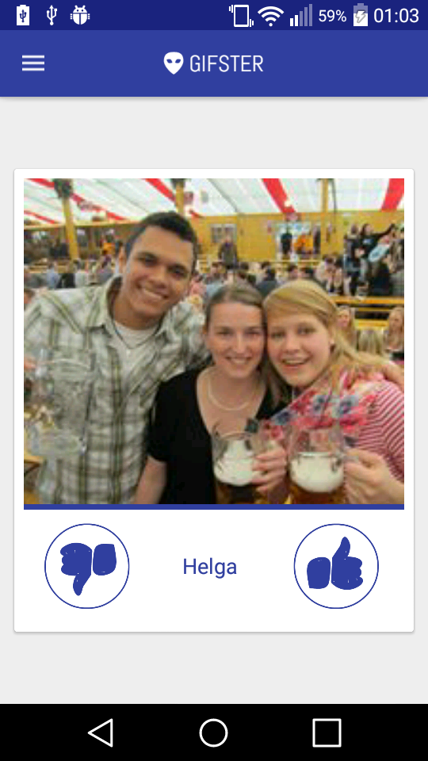

# GIFster

It is an application for meeting with new people and learning who they are over GIFs.

Powered by GIPHY

### Screenshots
 

### Libraries used in the project
* [Firebase](https://github.com/firebase)
* [Glide](https://github.com/bumptech/glide)
* [Retrofit](https://github.com/square/retrofit)
* [AppIntro](https://github.com/PaoloRotolo/AppIntro)
* [Picasso](https://github.com/square/picasso)
* [Spotlight](https://github.com/wooplr/Spotlight)

### TODO
* Add tests

License
-------
    Copyright 2016 Muhammed Salih GÜLER - msalihguler 

    Licensed under the Apache License, Version 2.0 (the "License");
    you may not use this file except in compliance with the License.
    You may obtain a copy of the License at

       http://www.apache.org/licenses/LICENSE-2.0

    Unless required by applicable law or agreed to in writing, software
    distributed under the License is distributed on an "AS IS" BASIS,
    WITHOUT WARRANTIES OR CONDITIONS OF ANY KIND, either express or implied.
    See the License for the specific language governing permissions and
    limitations under the License.
